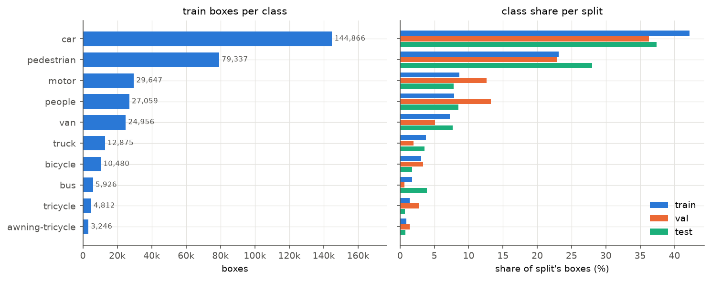
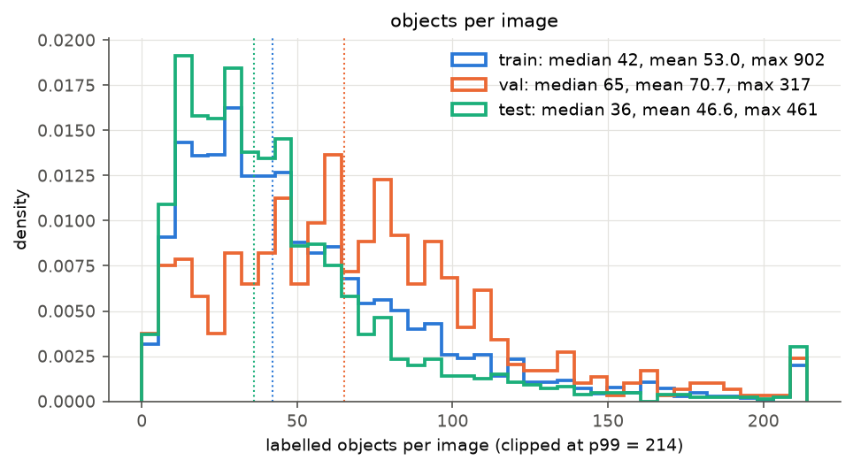
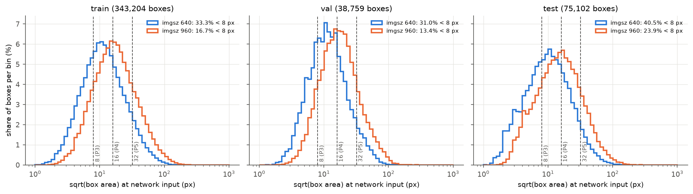
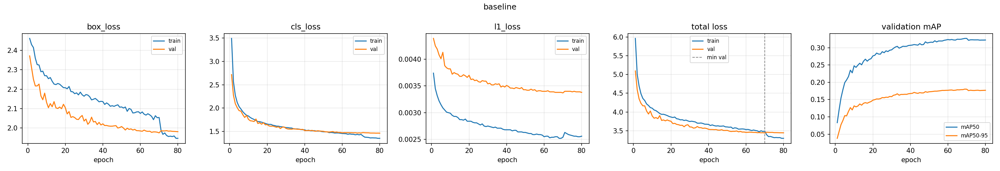
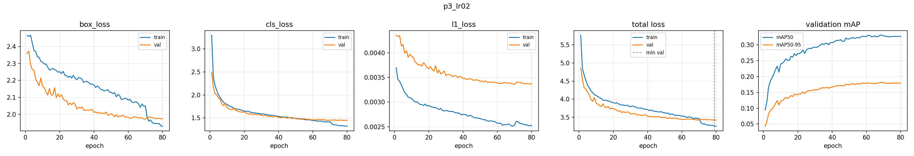
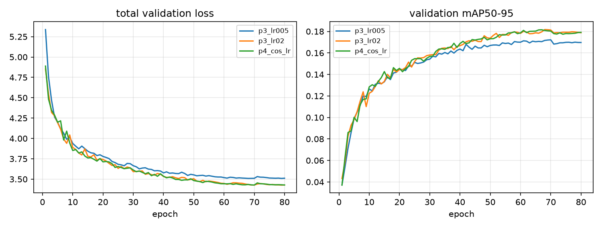
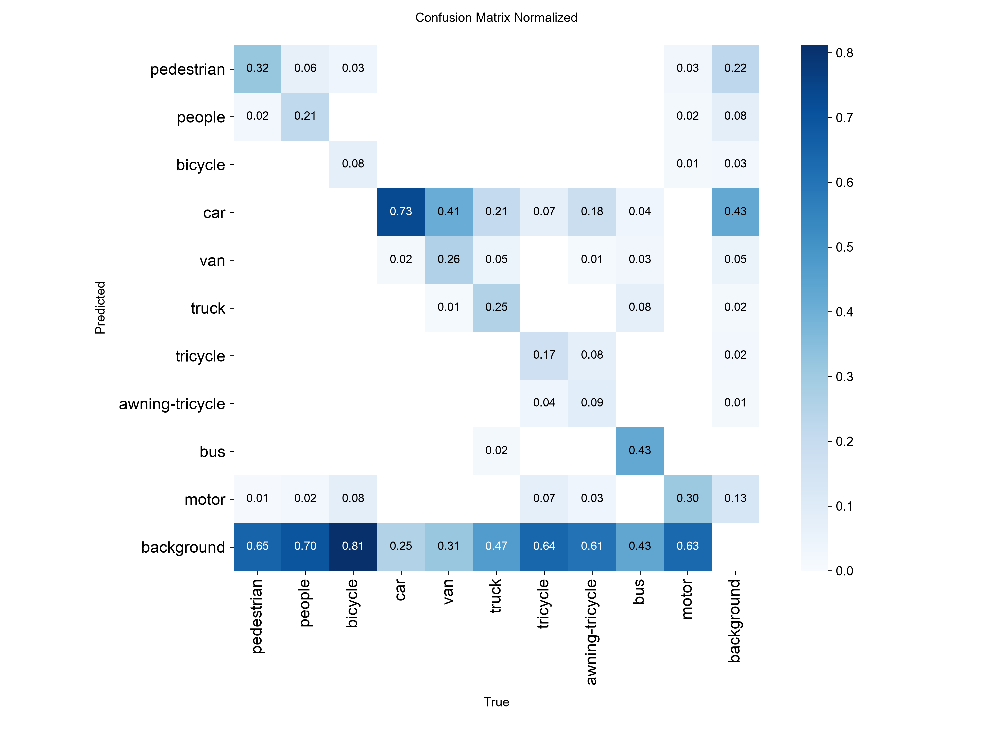

# Design, Optimization, and Comparative Evaluation of Modern YOLO Models for Real-World Object Detection

CMPE 401: Instructor-defined Project 1 · Ezra Krause, Cole Robulack

**Summary.** We fine-tuned COCO-pretrained YOLO26n on VisDrone2019-DET. The baseline reaches mAP50-95 0.1463 on test-dev (0.1808 on val). Its loss curves show no overfitting. Our working hypothesis is that it is limited mainly by input resolution (and possibly capacity): a third of the training boxes are smaller than one stride-8 cell at 640 px. A controlled learning-rate sweep (Part III) found lr0 = 0.02 best, with test mAP50-95 0.1529 (+0.0066, about 4× our measured run-to-run noise). One improvement cycle (Part IV) replaced linear with cosine LR decay and gave no measurable change. YOLOv8n trained with the same recipe matches YOLO26n on accuracy (Part V). YOLO26n has 21% fewer parameters and 34% fewer GFLOPs after fusing for inference (17% and 28% as trained), but it is not faster at batch 1 on the devices we could test.

All result numbers come from files committed under [`results/`](../results/) and [`report/tables/`](tables/). Each run is one named entry in [`configs/experiments.yaml`](../configs/experiments.yaml). Statements about Ultralytics' internal behaviour refer to the source of version 8.4.162, the version used for every run.

## 1. Setup

### 1.1 Model and data

- **Model:** YOLO26n (Ultralytics `yolo26n.pt`, COCO-pretrained). The trained 10-class model has 2.51 M parameters and 5.9 GFLOPs at 640 px, as reported by `src/evaluate.py`. After fusing for inference it has 2.38 M parameters and 5.32 GFLOPs (`results/speed/`). Part V adds YOLOv8n (`yolov8n.pt`).
- **Data:** VisDrone2019-DET via Ultralytics' built-in `VisDrone.yaml`, with 10 classes and 6,471 train / 548 val / 1,610 test-dev images. Ignored regions are dropped by the converter. Ultralytics' metric then scores detections that fall inside ignored regions as false positives, unlike the official VisDrone toolkit, so our test-dev mAP is not directly comparable with published VisDrone results. The `test` split in this report is **test-dev**, which has public labels. We did not score testset-challenge.

### 1.2 Dataset

The label statistics below come from `src/dataset_stats.py` → [`results/dataset/stats.json`](../results/dataset/stats.json). Box size is sqrt(w·h) after Ultralytics resizes the long side of the image to the network input size.

| | train | val | test-dev |
|---|---|---|---|
| Images | 6,471 | 548 | 1,610 |
| Boxes | 343,204 | 38,759 | 75,102 |
| Objects per image: mean / median / max | 53.0 / 42 / 902 | 70.7 / 65 / 317 | 46.6 / 36 / 461 |
| Median box size at 640 px | 11.1 px | 11.3 px | 9.8 px |
| Boxes < 8 px at 640 (smaller than one stride-8 cell) | 33.3% | 31.0% | 40.5% |
| Boxes < 16 px at 640 | 68.3% | 69.9% | 72.6% |
| Boxes < 8 px at 960 | 16.7% | 13.4% | 23.9% |
| Largest / smallest class (box count ratio) | 44.6 | 56.0 | 53.0 |

In the training set, `car` accounts for 42.2% of boxes (144,866) and `awning-tricycle` for 0.9% (3,246). Test-dev has smaller objects than val (40.5% vs 31.0% of boxes under 8 px), and this matters when comparing the two splits (§2).



*Training boxes per class (left) and each class's share of the boxes in each split (right).*



*Labelled objects per image for each split (clipped at the 99th percentile, 214); dotted lines mark the medians.*



*Box size at the network input for 640 vs 960 px, per split; dashed lines mark strides 8/16/32 (P3/P4/P5).*

### 1.3 Training recipe (shared by every run)

The `common` block of `configs/experiments.yaml` sets 80 epochs, 640 px input, batch 16, SGD, lr0 = 0.01, seed 0, `deterministic=True`, patience 30 (never triggered: every run completed 80 epochs) and `max_det=1000`. Val and test-dev images contain up to 317 and 461 objects. We pin `max_det=1000` so every run and split uses the same cap. Otherwise Ultralytics 8.4.162 would raise its default of 300 to the largest object count it observes (902 during training, where it also checks the train split, and each split's own maximum in standalone validation).

The rest are Ultralytics 8.4.162 defaults, confirmed in the committed `args.yaml` of every run except `baseline`, whose `args.yaml` is still on Ezra's Drive (§2). The LR decays linearly towards lr0 × lrf with lrf = 0.01, after 3 warm-up epochs. Momentum is 0.937 and weight decay 0.0005. Batch 16 is accumulated to a nominal batch of 64 (`nbs`). Augmentation uses mosaic 1.0, which is switched off for the last 10 epochs (`close_mosaic: 10`, i.e. epochs 71–80), plus scale 0.5, translate 0.1, fliplr 0.5 and HSV jitter. AMP is on for the CUDA runs.

The optimizer is pinned to SGD because `optimizer=auto` ignores lr0, and Part III varies lr0.

### 1.4 Runs and hardware

| Run | Part | Change vs `baseline` | Hardware | AMP | Training time (80 epochs) |
|---|---|---|---|---|---|
| `baseline` | I, II | none | Colab T4 | on | 3.84 h |
| `p3_lr005` | III | lr0 = 0.005 | Colab T4 | on | 3.64 h |
| `p3_lr02` | III | lr0 = 0.02 | Colab T4 | on | 3.54 h |
| `p3_lr005_mps` | III (noise estimate) | same recipe as `p3_lr005` | Apple M3 Pro (MPS) | off | 6.94 h |
| `p4_cos_lr` | IV | lr0 = 0.02, `cos_lr=True` | NVIDIA A100 80 GB (Nebula Cloud) | on | 0.66 h |
| `p5_yolov8n` | V | `model=yolov8n.pt` | Apple M3 Pro (MPS) | off | ≈5.1 h compute (8.1 h wall clock minus ≈3.0 h of laptop sleep in epochs 46, 49 and 50) |

All runs use Ultralytics 8.4.162. The CUDA runs use torch 2.11.0+cu128. On MPS, Ultralytics turns off AMP and uses a single dataloader process (`ultralytics/engine/trainer.py`, `ultralytics/utils/checks.py`). `p4_cos_lr` ran on a rented A100 because the Colab free-tier GPU quota was used up. Its only machine-specific setting is `workers=16`. The Part III comparison uses only T4 runs.

The machine-specific settings leave every hyperparameter unchanged, but two of them change the augmentation stream. With `cache=ram` (the two MPS runs), mosaic draws its partner images uniformly from the whole dataset instead of from a rolling buffer of recently loaded images (`ultralytics/data/augment.py`, `ultralytics/data/base.py`). `workers` changes how many per-worker buffers there are (`p4_cos_lr` used 16 against 4 on the T4).

### 1.5 Evaluation protocol

- `src/evaluate.py` re-validates each run's `best.pt` with 640 px, batch 16, `max_det=1000` and Ultralytics' default validation thresholds (conf 0.001, IoU 0.7). It writes `results/<run>/metrics_{val,test}.json`.
- **YOLO26n head at evaluation.** Every run's `args.yaml` has Ultralytics' default `nms: null`. With that setting, YOLO26n is evaluated through its one-to-many head with NMS (IoU 0.7), the same post-processing as YOLOv8n, not through its NMS-free one-to-one head. This holds for training-time validation, `src/evaluate.py` and the speed benchmark (§6). We did not evaluate the NMS-free mode (`nms=False`).
- **Primary metric:** mAP50-95. mAP50, precision and recall are also reported. Ultralytics reports P and R at the single confidence threshold that maximizes mean F1, so the two can trade off against each other between runs. mAP is threshold-free.
- **Val** (548 images) is used for checkpoint selection and training curves. Ultralytics picks `best.pt` by validation fitness, so val scores are slightly optimistic. **Test-dev** (1,610 images) is never used for checkpoint selection and is the headline number. It did inform one decision: we looked at it when confirming the Part III winner (§4.6).
- Per-epoch curves come from each run's `results.csv`, which records Ultralytics' validation during training. Those values can differ from the final re-evaluation in the fourth decimal: the baseline peaks at 0.1803 during training and scores 0.1808 on re-evaluation. The gap is up to 0.0009 on the CUDA runs (`p3_lr02`: 0.1817 vs 0.1826), where Ultralytics validates with fp16 inputs during training because AMP is on, and at most 0.0001 on the MPS runs, which validate in fp32 throughout.
- Inference speed and training time in `metrics_*.json` and in the `report/tables/*.md` columns were measured on whichever device each run used: T4 for the baseline and Part III, A100 for Part IV, and the Mac CPU for `p5_yolov8n` speed. **Those columns cannot be compared across runs.** Part V uses a same-device benchmark instead (§6).

## 2. Part I: Baseline

YOLO26n with the common recipe (`baseline`), trained on a Colab T4.

| Metric | Val | Test-dev |
|---|---|---|
| Precision | 0.4393 | 0.3873 |
| Recall | 0.3440 | 0.3066 |
| mAP50 | 0.3277 | 0.2697 |
| **mAP50-95** | **0.1808** | **0.1463** |

The best epoch is 69 of 80.

**Per-class AP50-95.** Class shares come from the train split. Sizes and the < 8 px share come from test-dev at 640 px.

| Class | Train share | Test median size | Test boxes < 8 px | Val AP50-95 | Test AP50-95 |
|---|---|---|---|---|---|
| pedestrian | 23.1% | 5.5 px | 71.1% | 0.1503 | 0.0857 |
| people | 7.9% | 5.4 px | 73.6% | 0.0927 | **0.0373** |
| bicycle | 3.1% | 9.1 px | 41.6% | 0.0326 | **0.0260** |
| car | 42.2% | 13.4 px | 22.4% | 0.4890 | 0.4065 |
| van | 7.3% | 14.3 px | 15.3% | 0.2451 | 0.1896 |
| truck | 3.8% | 22.4 px | 9.4% | 0.1935 | 0.1876 |
| tricycle | 1.4% | 13.9 px | 16.2% | 0.1103 | 0.0574 |
| awning-tricycle | 0.9% | 15.3 px | 13.2% | 0.0660 | 0.0607 |
| bus | 1.7% | 24.5 px | 7.2% | 0.2768 | 0.3215 |
| motor | 8.6% | 8.8 px | 42.2% | 0.1520 | 0.0910 |

The four smallest classes (pedestrian, people, bicycle, motor) have median test sizes under 10 px and test AP50-95 ≤ 0.091. Size matters more than frequency. `bus` has only 1.7% of training boxes, but its objects are the largest and it ranks second (0.3215). `pedestrian` has 23.1% of boxes, but its objects are tiny and it scores 0.0857. The rare mid-size classes, tricycle and awning-tricycle, are also weak.

The drop from val to test (0.1808 → 0.1463) is broad. The four small classes account for about half (54%) of the drop in summed per-class AP, and they lose the most in relative terms: people −60%, pedestrian −43% and motor −40%, against car −17%. The rare mid-size tricycle also loses 48%. Car still has the largest absolute drop (0.4890 → 0.4065), and bus improves on test. This fits with test-dev objects being smaller (§1.2), but size is not the only factor.



*Baseline training and validation losses (box, cls, l1, total) and validation mAP. YOLO26 has no DFL term (`reg_max: 1`). Its third loss component is an L1 box term. For YOLO26n, Ultralytics logs the losses of the one-to-one branch only (`E2ELoss` returns `loss_one2one`). The optimized objective also includes the one-to-many branch, whose weight decays from 0.8 to 0.1 over training, and mAP is measured with the one-to-many head (§1.5).*

**Missing baseline files.** The baseline's metrics JSONs, `loss_summary.json` and loss-curve figure were recovered verbatim from the notebook outputs at commit `fe0b017` ([`results/baseline/NOTES.md`](../results/baseline/NOTES.md)). Its `results.csv`, `args.yaml`, confusion matrices and PR/F1 curves are still on Ezra's Google Drive and are not in the repo. So per-epoch statements about the baseline in this report rely only on `loss_summary.json` and the figure above.

## 3. Part II: Loss curves and fitting analysis

The baseline curves are shown above. The table below adds per-epoch facts from the `results.csv` of every run that has one. Losses are the sum of the three components. For YOLO26n these are the one-to-one branch's logged losses (see the §2 caption).

| Run | Val-loss min (epoch) | Val loss, epoch 80 | Val loss, epoch 80 vs min | Best val mAP50-95 epoch | Train-loss change, epoch 70→71 | Val−train gap, epoch 70 | Val−train gap, epoch 80 |
|---|---|---|---|---|---|---|---|
| `baseline` | 3.4404 (70) | 3.4440 | 0.11% | 69 | n/a (no CSV) | n/a | +0.1456 |
| `p3_lr005` | 3.5092 (68) | 3.5118 | 0.07% | 70 | −0.0792 | −0.0592 | +0.1118 |
| `p3_lr02` | 3.4268 (79) | 3.4285 | 0.05% | 68 | −0.1083 | −0.0441 | +0.1724 |
| `p4_cos_lr` | 3.4277 (70) | 3.4283 | 0.02% | 67 | −0.0882 | +0.0265 | +0.1910 |
| `p3_lr005_mps` | 3.5032 (68) | 3.5114 | 0.23% | 63 | −0.0673 | −0.0114 | +0.1380 |
| `p5_yolov8n`\* | 3.3702 (79) | 3.3710 | 0.02% | 80 | −0.0560 | +0.0343 | +0.1700 |

\*YOLOv8n's absolute loss values are not comparable with the YOLO26n rows: its third loss term is DFL rather than L1, and its logged losses come from its single head (assigner top-k 10) rather than from a one-to-one branch.



*`p3_lr02` training vs validation losses (box, cls, l1, total) and validation mAP. The drop in training loss at epoch 71 is where mosaic is switched off.*

**Convergence.** Every run converges smoothly, with no spikes or divergence. Most of the loss drop happens in the first 10 epochs (validation loss goes from 4.5–5.3 at epoch 1 to 3.8–3.9 at epoch 10). After that, both metrics keep improving, more and more slowly: at epoch 10 validation loss is still 12–14% above its eventual minimum, and validation mAP50-95 rises another 35–48% (e.g. `p3_lr02`: 0.1225 at epoch 10 → 0.1817 at epoch 68). In the runs that have a CSV, validation loss stays within 1% of its minimum from epoch 54–58 onward, and validation mAP50-95 first comes within 0.002 of its best at epoch 58–64. After that the curves are flat. The baseline's validation loss bottoms out at epoch 70 (3.4404) and its best mAP is at epoch 69. The YOLO26n runs peak at epochs 63–70, which is at or before the mosaic switch.

**close_mosaic at epoch 71.** When mosaic turns off for the last 10 epochs, training loss drops by 0.056–0.108 in a single epoch. Validation loss rises slightly (by 0.011–0.026) and validation mAP50-95 falls by 0.001–0.004, then partly recovers. In the YOLO26n runs it never gets back above its pre-switch peak. Training losses are computed on augmented images: mosaic tiles, ±50% scale and flips. They are also a running mean over the epoch from the live (non-EMA) weights in train mode, while validation loss is computed at the end of the epoch with the EMA weights in eval mode. Training loss is therefore not a clean measure of fit to the training set. Before epoch 71 the validation loss is mostly *below* the training loss: in all of epochs 1–70 for `p3_lr005`, `p3_lr02` and `p3_lr005_mps`, and in 64 and 59 of those 70 epochs for `p4_cos_lr` and `p5_yolov8n`. For example, `p3_lr02` has a gap of −0.044 at epoch 70. After mosaic turns off the gap becomes clearly positive in every run (0.11–0.19 at epoch 80), but we did not separate the effect of the augmentation change from a generalization gap.

**Overfitting: not observed.** The classic signature would be validation loss rising while training loss keeps falling. Here validation loss ends at most 0.23% above its minimum (0.11% for the baseline). The largest rise after the minimum is +0.76% (`p4_cos_lr`, epoch 71, the mosaic switch), and it recovers to within 0.02–0.23% of the minimum by epoch 80. For the baseline only the epoch-80 figure is known, because its `results.csv` is not in the repo. Validation mAP does not decline before the mosaic switch. The val−train gap stays small, at 0.11–0.19 on total losses of about 3.2–3.5.

**Underfitting: yes, in the high-bias sense.** Both losses plateau at similar, high values. Even with mosaic off, training loss (still measured on augmented batches) ends only slightly below validation loss. mAP50-95 levels off at about 0.18 on val. Part III is consistent with this: a larger learning rate lowered *both* training and validation loss and raised mAP (§4). That is how a model that is not yet fitting well behaves, not one that is memorizing.

**Causes.**

- **Dataset size.** 6,471 training images is a small dataset by image count. By supervision it is large: 343,204 boxes, 53 per image on average and up to 902. Augmentation also creates new views every epoch. A 2.5 M-parameter model given this much dense supervision is unlikely to memorize it, which is consistent with the absence of overfitting. The data is limited in two other ways:
  - *Class imbalance.* The largest-to-smallest class ratio is 44.6:1. Tricycle, awning-tricycle and bus have only 3,246–5,926 training boxes each. The rare classes with small or mid-size objects are among the weakest (§2).
  - *Object scale.* At 640 px, 33.3% of training boxes and 40.5% of test boxes are smaller than 8 px, which is one cell of the stride-8 P3 map. P3 is the finest feature map in YOLO26n and YOLOv8n. For pedestrian and people, 71–74% of test boxes are under 8 px. Objects this small are mixed with background early in the backbone, whatever the amount of data.
- **Model capacity.** YOLO26n is the smallest scale: width multiple 0.25 and depth multiple 0.50 (`ultralytics/cfg/models/26/yolo26.yaml`), with 2.51 M parameters and 5.9 GFLOPs. Its detection heads are at strides 8, 16 and 32, with no stride-4 (P2) head. This may limit how many features it can devote to separating tiny, similar-looking classes. The confusion matrices (§6.3) show that 43–81% of objects are missed for every class except car and van, for the small classes and the rare mid-size classes alike, and that the main confusion between classes is van → car. Part V gives some evidence against raw capacity as the binding limit: YOLOv8n, with 26% more fused parameters and 52% more fused GFLOPs, is no more accurate (§6).

**Diagnosis.** The baseline is predominantly bias-limited, not variance-limited: we see no overfitting. Our working hypothesis is that input resolution (and possibly capacity) is the main limit. Per-class AP tracks object size and a third of the boxes are below one stride-8 cell, but this evidence is correlational: we have not yet tested a resolution or model-size change. Part IV (§5) later found that changing the shape of the LR schedule moved neither the losses nor mAP, so further optimizer tuning appears to have diminishing returns. Regularization such as `p4_regularize` (weight decay 0.001, mixup 0.1) is not the right tool for a bias-limited model, and we did not run it. The levers that could help are optimization (Part III/IV), more pixels per object (higher resolution, the planned second cycle in §5.7) or a larger model.

## 4. Part III: Controlled experiment (initial learning rate)

### 4.1 Question and hypothesis

Is the baseline's lr0 = 0.01 a good choice for fine-tuning COCO-pretrained YOLO26n on VisDrone? The domain shift is large: aerial viewpoint and tiny objects. Under linear decay, lr0 scales the step size for all 80 epochs. A higher lr0 lets the weights move further from the COCO solution, which could help adaptation or could damage the pretrained features. A lower lr0 preserves those features but may not finish adapting in 80 epochs. We bracketed the default by a factor of 2 in each direction.

### 4.2 Settings

- **Controlled variable:** `lr0` ∈ {0.005, 0.01 (`baseline`), 0.02}.
- **Held fixed:** everything else. That means YOLO26n, 80 epochs, SGD, linear decay towards lr0 × 0.01, 3 warm-up epochs, batch 16 (nominal 64), 640 px, the default augmentation, seed 0, deterministic mode and `max_det=1000`. The `args.yaml` files of `p3_lr005` and `p3_lr02` differ only in `lr0`, `name` and `save_dir`.
- **Same hardware and software:** Colab T4, Ultralytics 8.4.162, torch 2.11.0+cu128, AMP on.
- **Why not batch size:** Ultralytics accumulates gradients up to a nominal batch of 64, so changing `batch` barely changes the effective batch per optimizer step.

### 4.3 Results

The differences are relative to `baseline`. The generated tables are in [`tables/part3_val.md`](tables/part3_val.md) and [`tables/part3_test.md`](tables/part3_test.md). Their Inference and Train-time columns were measured on each run's own machine and are not comparable across runs (§1.5).

| Split | Run | lr0 | P | R | mAP50 | mAP50-95 | Δ mAP50-95 |
|---|---|---|---|---|---|---|---|
| Val | `p3_lr005` | 0.005 | 0.4253 | 0.3360 | 0.3155 | 0.1727 | −0.0081 |
| Val | `baseline` | 0.01 | 0.4393 | 0.3440 | 0.3277 | 0.1808 | 0 |
| Val | `p3_lr02` | 0.02 | 0.4469 | 0.3416 | 0.3312 | **0.1826** | +0.0018 |
| Test-dev | `p3_lr005` | 0.005 | 0.3805 | 0.3000 | 0.2653 | 0.1441 | −0.0022 |
| Test-dev | `baseline` | 0.01 | 0.3873 | 0.3066 | 0.2697 | 0.1463 | 0 |
| Test-dev | `p3_lr02` | 0.02 | 0.4064 | 0.3119 | 0.2800 | **0.1529** | **+0.0066** |

mAP50 and mAP50-95 rise with lr0 on both splits. On test-dev, lr0 = 0.02 improves mAP50-95 by 4.5% relative (+0.0066) and mAP50 by 3.8% (+0.0103).

**Per-class test AP50-95:**

| Class | lr0 0.005 | lr0 0.01 | lr0 0.02 | Δ (0.02 − 0.01) |
|---|---|---|---|---|
| pedestrian | 0.0830 | 0.0857 | 0.0859 | +0.0002 |
| people | 0.0344 | 0.0373 | 0.0406 | +0.0033 |
| bicycle | 0.0245 | 0.0260 | 0.0316 | +0.0056 |
| car | 0.3981 | 0.4065 | 0.4083 | +0.0018 |
| van | 0.1842 | 0.1896 | 0.1921 | +0.0025 |
| truck | 0.1899 | 0.1876 | 0.2012 | +0.0136 |
| tricycle | 0.0585 | 0.0574 | 0.0707 | +0.0133 |
| awning-tricycle | 0.0634 | 0.0607 | 0.0714 | +0.0107 |
| bus | 0.3166 | 0.3215 | 0.3287 | +0.0072 |
| motor | 0.0887 | 0.0910 | 0.0979 | +0.0069 |

On test, lr0 = 0.02 improves all 10 classes. The largest gains are on truck, tricycle and awning-tricycle. On val the per-class picture is mixed: 7 of 10 classes improve, while truck (−0.0053), tricycle (−0.0018) and bicycle (−0.0008) drop. Per-class differences between the two replicate runs reach 0.009 (§4.5). So we do not claim any class-specific effect.

### 4.4 Training dynamics



*Validation loss and mAP50-95 per epoch for `p3_lr005`, `p3_lr02` and `p4_cos_lr` (Part IV). The baseline is missing because its `results.csv` is not in the repo.*

The table shows training-time validation mAP50-95, with the LR at the end of each epoch in brackets (from `results.csv`):

| Epoch | 10 | 20 | 40 | 60 | 70 | 80 |
|---|---|---|---|---|---|---|
| `p3_lr005` | 0.1265 (0.0044) | 0.1450 (0.0038) | 0.1636 (0.0026) | 0.1700 (0.0013) | 0.1722 (0.0007) | 0.1697 (0.0001) |
| `p3_lr02` | 0.1225 (0.0178) | 0.1444 (0.0153) | 0.1667 (0.0103) | 0.1782 (0.0054) | 0.1813 (0.0029) | 0.1788 (0.0004) |

Up to epoch 20 neither run is consistently ahead: the gap swings between −0.011 and +0.009 in epochs 1–10 and stays within 0.0035 in epochs 11–20. From epoch 25 lr0 = 0.02 leads at every epoch, and the gap widens in the second half, when lr0 = 0.005 has decayed to very small steps: 0.0013 at epoch 60, against 0.0054 for lr0 = 0.02. The lower LR has higher validation loss at 78 of 80 epochs and ends with higher validation loss (3.5118 vs 3.4285) and higher training loss (3.4001 vs 3.2561). It has not avoided overfitting. It has simply fit less. The baseline sits between the two on every summary value: validation loss 3.4440, training loss 3.2984 and gap 0.1456. Higher lr0 gives lower training *and* validation loss, a slightly larger gap and higher mAP. This is consistent with the underfitting diagnosis in Part II.

### 4.5 Run-to-run noise

All runs use seed 0 and deterministic mode, but GPU kernels, AMP and dataloading still differ between machines. To measure how much two runs of one recipe differ, we repeated `p3_lr005` on an Apple M3 Pro ([`results/p3_lr005_mps/`](../results/p3_lr005_mps/NOTES.md)). The replicate used `cache=ram`, which changes how mosaic picks its partner images (§1.4), so it captures device, AMP and data-pipeline variation together:

| `p3_lr005` copy | Val mAP50-95 | Test mAP50-95 |
|---|---|---|
| Colab T4 | 0.1727 | 0.1441 |
| Apple M3 Pro | 0.1724 | 0.1426 |
| Difference | 0.0003 | 0.0015 |

Other differences between the pair are 0.0015–0.0045 for P, R and mAP50, and up to 0.009 for single-class AP50-95 (mean absolute 0.0023–0.0027). We use the 0.0003/0.0015 mAP50-95 differences only as a rough scale: differences of about 0.002 or less are inconclusive. This is a single replicate that shares the seed, so it may understate seed-to-seed variation (§7.2).

### 4.6 Analysis and conclusion

- **lr0 = 0.02 is the best of the three**, and it is the winner carried into Part IV. We pick it by the val ranking (0.1826 > 0.1808 > 0.1727), and test-dev ranks the three in the same order. On val the gain over the baseline (+0.0018) is within the noise scale, so val alone would not separate 0.02 from 0.01. On test-dev the gain (+0.0066) is about 4.4× the largest replicate difference (0.0015), and both mAP measures point the same way. Test-dev is the larger split and was not used for checkpoint selection. Because it did inform our confidence in this choice, `p3_lr02`'s test-dev score may be slightly optimistic.
- **lr0 = 0.005 is worse on val.** It loses 0.0081 on val, well beyond the replicate difference. On test it loses 0.0022, which is inconclusive.
- The trend rises monotonically over the range tried, so the sweep did not bracket the optimum. A value above 0.02 might help further. We did not test one.
- **Interpretation.** Fine-tuning YOLO26n to VisDrone within 80 epochs benefits from larger steps. We saw no sign that lr0 = 0.02 damaged the pretrained features or made training unstable. Its curves are as smooth as the others.

## 5. Part IV: Iterative improvement (cycle 1: LR schedule)

Baseline → Experimental settings → Controlled modification → Evaluation → Analysis → Conclusion

### 5.1 Baseline

The baseline for this cycle is `p3_lr02`, the Part III winner: YOLO26n, lr0 = 0.02, linear decay. It scores val mAP50-95 0.1826 and test-dev 0.1529.

### 5.2 Experimental settings

Identical to `p3_lr02` in every recipe key: 80 epochs, SGD, lr0 = 0.02, lrf = 0.01, 3 warm-up epochs, batch 16 (nominal 64), 640 px, the default augmentation with close_mosaic 10, seed 0 and `max_det=1000`. The `args.yaml` files differ only in `cos_lr`, plus the machine-specific `workers` (16 vs 4), `project`, `name` and `save_dir`. Software is the same: Ultralytics 8.4.162, torch 2.11.0+cu128, AMP on. **The hardware differs**: one A100 80 GB on Nebula Cloud instead of a Colab T4, because the Colab free-tier GPU quota was used up.

### 5.3 Controlled modification and justification

**Change:** `cos_lr: true`, so the LR follows a cosine curve instead of a straight line from lr0 towards lr0 × lrf. It is a single-key change (`p4_cos_lr` in `configs/experiments.yaml`).

**Why this change (DL principle: LR annealing).**

- Part II found no overfitting and a plateau from about epoch 60, with best epochs 68–70 for the Part I/III T4 runs (63–70 including the replicate). So regularization is the wrong tool. What remains is how the optimizer uses its step-size budget as it approaches the plateau.
- Part III showed that results are sensitive to LR magnitude. Schedule shape is the next LR setting to test.
- Annealing theory says large steps early help the optimizer explore and escape poor regions, and small, smoothly annealed steps late let it settle into a lower minimum. Cosine decay is the standard way to do this. Compared with linear decay, it holds the LR within 90% of lr0 for about twice as long (through epoch 17 vs epoch 9 in our logs), then anneals faster through the second half and flattens out at the end.
- Both schedules follow lr0 · lf(epoch) from lr0 towards lr0 × lrf. In our logs their mean LR over the 80 epochs is the same: 0.00997 for parameter group 0 in both `results.csv` files. The experiment therefore isolates the *shape* of the schedule at a fixed LR budget. In practice the last epoch runs at 0.00045 (linear) vs 0.00021 (cosine), because Ultralytics' linear schedule reaches lr0 × lrf only at the end of epoch 80.

**Hypothesis:** cosine decay converges to a better final model than linear decay, with higher mAP50-95 at the same epoch budget.

### 5.4 Evaluation

The generated tables are [`tables/part4_val.md`](tables/part4_val.md) and [`tables/part4_test.md`](tables/part4_test.md). Their Inference and Train-time columns were measured on different GPUs (T4 vs A100) and are not comparable (§1.5).

| Split | Run | Schedule | P | R | mAP50 | mAP50-95 | Δ mAP50-95 |
|---|---|---|---|---|---|---|---|
| Val | `p3_lr02` | linear | 0.4469 | 0.3416 | 0.3312 | 0.1826 | 0 |
| Val | `p4_cos_lr` | cosine | 0.4471 | 0.3453 | 0.3303 | 0.1820 | −0.0006 |
| Test-dev | `p3_lr02` | linear | 0.4064 | 0.3119 | 0.2800 | 0.1529 | 0 |
| Test-dev | `p4_cos_lr` | cosine | 0.3937 | 0.3166 | 0.2781 | 0.1514 | −0.0015 |

The best epoch is 67 for cosine and 68 for linear.

The next table shows the LR schedule and training-time validation mAP50-95 (from `results.csv`):

| Epoch | 10 | 20 | 40 | 60 | 70 | 80 | Mean LR |
|---|---|---|---|---|---|---|---|
| LR, linear (`p3_lr02`) | 0.0178 | 0.0153 | 0.0103 | 0.0054 | 0.0029 | 0.0004 | 0.00997 |
| LR, cosine (`p4_cos_lr`) | 0.0194 | 0.0174 | 0.0105 | 0.0034 | 0.0011 | 0.0002 | 0.00997 |
| mAP50-95, linear | 0.1225 | 0.1444 | 0.1667 | 0.1782 | 0.1813 | 0.1788 | |
| mAP50-95, cosine | 0.1284 | 0.1456 | 0.1687 | 0.1787 | 0.1803 | 0.1791 | |

### 5.5 Analysis

- **Performance.** Cosine decay changed mAP50-95 by −0.0006 on val and −0.0015 on test-dev. Both are within run-to-run noise: at or below the largest replicate difference (0.0015), so inconclusive (§4.5). Recall rose slightly (+0.0037 val, +0.0047 test) and test precision fell (−0.0127). P and R are measured at one max-F1 threshold and can trade off. The threshold-free mAP did not move.
- **Training curves.** The validation curves of the two runs overlap almost exactly (overlay in §4.4). There is no systematic difference at any stage. Cosine is ahead in 15 of the 31 epochs from 10 to 40, when its LR is higher by 0.0015 on average (mean mAP50-95 difference +0.0009), and in 16 of the 40 epochs from 41 to 80. Training loss at epoch 80 is 3.2373 (cosine) vs 3.2561 (linear), a smaller gap than the 0.027 between the two `p3_lr005` replicates, and validation loss is identical (3.4283 vs 3.4285). Neither loss separates the schedules.
- **Why no gain (likely explanation).** Both schedules have the same mean LR (0.00997). Their final-epoch LRs are 0.00045 (linear) and 0.00021 (cosine). From epoch 42 on, cosine's LR is lower, by 37–55% at epochs 60–67, yet the validation curves overlap there too and both runs peak at epochs 67–68 at the same mAP. At a fixed mean LR, the plateau is insensitive to the shape of the schedule within noise. This is consistent with the Part II hypothesis that the limit lies elsewhere (resolution or capacity), which the schedule shape does not change.
- **Hardware caveat.** `p4_cos_lr` ran on an A100 and `p3_lr02` on a T4, with different `workers` (16 vs 4). The T4-vs-M3 Pro replicate (§4.5) differed by at most 0.0015 mAP50-95 across different hardware and numerics, AMP on vs off. From that one replicate we take a hardware effect of that order as plausible here. It is the same size as the observed differences, so the result is "no measurable effect" rather than "cosine is worse".

### 5.6 Conclusion

The hypothesis is not supported. At this LR budget and epoch count, cosine decay performs the same as linear decay within noise. We keep linear decay, the Ultralytics default, and `p3_lr02` remains our best model: test-dev mAP50-95 0.1529 and mAP50 0.2800. This null result is consistent with the Part II diagnosis: once lr0 is set well, changing the schedule shape does not lift the plateau.

**Improvement trajectory (Parts I → III → IV).**

| Step | Run | Change | Val mAP50-95 | Test-dev mAP50-95 | Kept? |
|---|---|---|---|---|---|
| Part I | `baseline` | YOLO26n, lr0 = 0.01, linear decay | 0.1808 | 0.1463 | reference |
| Part III | `p3_lr02` | lr0 0.01 → 0.02 | 0.1826 | 0.1529 | yes |
| Part IV, cycle 1 | `p4_cos_lr` | linear → cosine decay | 0.1820 | 0.1514 | no (within noise) |

The kept model, `p3_lr02`, improves test-dev mAP50-95 by +0.0066 over the Part I baseline.

### 5.7 Next cycle (planned, not yet run): input resolution 960 px

- **Baseline:** `p3_lr02` (cycle 1 kept linear decay).
- **Modification:** change only `imgsz`, from 640 to 960. The entry `p4_imgsz960` in `configs/experiments.yaml` (`base: p3_lr02`, `imgsz: 960`) defines it. The older `p3_imgsz960` entry is based on `baseline` (lr0 = 0.01), so it would change two keys relative to `p3_lr02`.
- **Justification (from `stats.json`):** at 960 px, the share of boxes smaller than one stride-8 cell falls from 33.3% to 16.7% on train and from 40.5% to 23.9% on test-dev. For the weakest classes, pedestrian goes from 71.1% to 48.9% of test boxes under 8 px and people from 73.6% to 49.0%. This directly tests the resolution hypothesis from Part II.
- **Cost:** about 2.25× the pixels per image, (960/640)², with a comparable increase in training and inference compute.
- This cycle is outside the scope of this submission; no results are reported for it.

## 6. Part V: YOLO26n vs YOLOv8n (optional)

### 6.1 Settings

`p5_yolov8n` is the baseline recipe with only `model=yolov8n.pt` changed: 80 epochs, SGD lr0 = 0.01, batch 16, 640 px, seed 0, `max_det=1000`. It was trained on an Apple M3 Pro (MPS) with `cache=ram`, while `baseline` was trained on a Colab T4 without a RAM cache. Both the device and the mosaic partner selection (§1.4) therefore differ. The replicate in §4.5 suggests the device effect on YOLO26n accuracy is of order 0.0015 mAP50-95 (one replicate).

Inference speed was re-measured for both architectures on one machine with `src/benchmark_speed.py`. Settings: Apple M3 Pro with MPS and CPU, torch 2.14.0, Ultralytics 8.4.162, batch 1, 640 px, Ultralytics predict defaults (conf 0.25, `nms=None`), 10 warm-up images, then the median over 200 val images. Both models were therefore timed with NMS: under the default `nms=None`, YOLO26n uses its one-to-many head plus NMS. Forward-pass cost depends on the architecture, not the weights; NMS time varies a little with the number of detections. The YOLO26n timing used the `p3_lr02` checkpoint, since the baseline's weights are on Ezra's Drive.

### 6.2 Structured comparison

| | YOLO26n (`baseline`) | YOLOv8n (`p5_yolov8n`) |
|---|---|---|
| Val P / R | 0.4393 / 0.3440 | 0.4584 / 0.3389 |
| Val mAP50 / mAP50-95 | 0.3277 / 0.1808 | 0.3295 / **0.1839** |
| Test-dev P / R | 0.3873 / 0.3066 | 0.3841 / 0.2970 |
| Test-dev mAP50 / mAP50-95 | 0.2697 / **0.1463** | 0.2624 / 0.1447 |
| Mean test AP50-95 of the 4 small classes (pedestrian, people, bicycle, motor) | **0.0600** | 0.0538 |
| Parameters, as trained / fused | 2.51 M / 2.38 M | 3.01 M / 3.01 M |
| GFLOPs at 640, as trained / fused | 5.9 / 5.32 | 8.2 / 8.09 |
| Weight file (`best.pt`) | 5.4 MB | 6.2 MB |
| Training time, as run (not comparable) | 3.84 h, Colab T4, AMP on | ≈5.1 h compute, M3 Pro MPS, AMP off (8.1 h wall clock minus ≈3.0 h sleep in epochs 46, 49 and 50) |
| Training time, same device (M3 Pro MPS, median epoch) | 316 s/epoch (`p3_lr005_mps`, 6.94 h total) | 226 s/epoch |
| Inference, M3 Pro MPS, batch 1: total per image\* | 9.90 ms | **7.55 ms** |
| Inference, M3 Pro CPU, batch 1: total (pre / inference / post) | **25.23 ms** (0.65 / 24.22 / 0.36) | 25.89 ms (0.68 / 24.83 / 0.37) |
| Best epoch (of 80) | 69 | 80 |
| Head | Trained with one-to-many + one-to-one heads (`reg_max 1`, no DFL); evaluated and timed with the one-to-many head + NMS at IoU 0.7, the Ultralytics 8.4.162 default (`nms=None`) | DFL head (`reg_max 16`); NMS at IoU 0.7 |
| Confusion matrix | Baseline's not in repo; proxy: [`p3_lr02`](../results/p3_lr02/confusion_matrix_normalized.png) (same architecture, lr0 = 0.02; §6.3) | [`confusion_matrix_normalized.png`](../results/p5_yolov8n/confusion_matrix_normalized.png) |

Notes on the table:

- \*Ultralytics does not synchronize MPS inside its stage timers (`ultralytics/utils/ops.py` only synchronizes CUDA, NPU and XPU), so the MPS pre / inference / post split in `results/speed/speed_mps.json` is not meaningful and is omitted here; only the MPS total is. The CPU split is meaningful. Totals are the sum of the per-stage medians over 200 images.
- Fusing drops one of YOLO26n's two detection branches. Under the default `nms=None`, `Detect.fuse()` in `ultralytics/nn/modules/head.py` removes the one-to-one branch and keeps the one-to-many branch used with NMS. The two branches are the same size, so the fused parameter count would be the same either way. Fusing also folds BatchNorm into the convolutions.
- The same-device training row compares YOLO26n and YOLOv8n trained with identical settings (MPS, `cache=ram`) on the same M3 Pro. The YOLO26n run is the `p3_lr005` replicate. Its lr0 differs, which does not affect compute per epoch.
- The generated tables are [`tables/part5_val.md`](tables/part5_val.md) and [`tables/part5_test.md`](tables/part5_test.md). Their speed and training-time columns come from different devices and should not be compared (§1.5).

**Per-class AP50-95** (differences are YOLOv8n − YOLO26n):

| Class | Val YOLO26n | Val YOLOv8n | Val Δ | Test YOLO26n | Test YOLOv8n | Test Δ |
|---|---|---|---|---|---|---|
| pedestrian | 0.1503 | 0.1407 | −0.0096 | 0.0857 | 0.0816 | −0.0041 |
| people | 0.0927 | 0.0905 | −0.0022 | 0.0373 | 0.0350 | −0.0023 |
| bicycle | 0.0326 | 0.0289 | −0.0037 | 0.0260 | 0.0191 | −0.0069 |
| car | 0.4890 | 0.4910 | +0.0020 | 0.4065 | 0.3973 | −0.0092 |
| van | 0.2451 | 0.2481 | +0.0030 | 0.1896 | 0.1759 | −0.0137 |
| truck | 0.1935 | 0.1953 | +0.0018 | 0.1876 | 0.1935 | +0.0059 |
| tricycle | 0.1103 | 0.1168 | +0.0065 | 0.0574 | 0.0644 | +0.0070 |
| awning-tricycle | 0.0660 | 0.0683 | +0.0023 | 0.0607 | 0.0739 | +0.0132 |
| bus | 0.2768 | 0.3160 | +0.0392 | 0.3215 | 0.3272 | +0.0057 |
| motor | 0.1520 | 0.1434 | −0.0086 | 0.0910 | 0.0794 | −0.0116 |

### 6.3 Confusion matrices



*YOLOv8n (`p5_yolov8n`), val split, conf 0.25. Columns are true classes and each column sums to 1.*

The baseline's confusion matrix is not in the repo. The closest YOLO26n matrix we have is from `p3_lr02`, which uses the same architecture with lr0 = 0.02: [`results/p3_lr02/confusion_matrix_normalized.png`](../results/p3_lr02/confusion_matrix_normalized.png).


*YOLO26n (`p3_lr02`, proxy for the baseline), val split, conf 0.25. Same layout as above.*

The two matrices are nearly identical:

| True class → predicted | YOLOv8n | YOLO26n (`p3_lr02`) |
|---|---|---|
| pedestrian → background (missed) | 0.65 | 0.64 |
| people → background | 0.70 | 0.72 |
| bicycle → background | 0.81 | 0.81 |
| motor → background | 0.63 | 0.62 |
| tricycle → background | 0.64 | 0.64 |
| awning-tricycle → background | 0.61 | 0.61 |
| truck → background | 0.47 | 0.49 |
| bus → background | 0.43 | 0.46 |
| car → background | 0.25 | 0.25 |
| van → background | 0.31 | 0.31 |
| van → car | 0.41 | 0.39 |
| truck → car | 0.21 | 0.17 |

Both models fail in the same way. The dominant error is missed objects: for every class except car and van, 43–81% of true objects are missed. Miss rates are highest for the small classes (bicycle 0.81, people 0.70–0.72) and nearly as high for the rare mid-size tricycle and awning-tricycle (0.61–0.64). This points to class rarity as well as object size. The main confusion between classes is van → car. None of this points to a flaw of one architecture.

### 6.4 Discussion

- **Accuracy is essentially tied.** YOLOv8n is ahead on val mAP50-95 (+0.0031), YOLO26n is ahead on test-dev (+0.0016), and mAP50 splits the same way. YOLOv8n's val lead is above our rough 0.002 noise scale; YOLO26n's test lead is not. The winner flips between splits, and the two models were trained on different devices, so neither is clearly better overall.
- **Per-class pattern.** YOLO26n is ahead on all four small classes on *both* splits: the mean of the four is 0.1069 vs 0.1009 on val and 0.0600 vs 0.0538 on test. YOLOv8n is ahead on bus, truck, tricycle and awning-tricycle on both splits. Most single-class differences (14 of 20) are within the per-class replicate noise (up to 0.009); the exceptions include bus on val (+0.0392). The consistent direction across 8 class × split pairs is suggestive, not conclusive. It fits the brief's description of YOLO26 as targeting small-object detection, but we cannot attribute it to a specific component.
- **Efficiency.** YOLO26n has 21% fewer fused parameters, 34% fewer fused GFLOPs and a 13% smaller weight file.
- **Speed.** Fewer FLOPs do not translate into lower latency at batch 1 on the hardware we could test. On MPS, YOLO26n is 31% slower end to end (9.90 vs 7.55 ms). On CPU it is 2.5% faster (25.23 vs 25.89 ms), which is effectively a tie. One plausible reason is layer count: the fused models that were timed have 120 layers (YOLO26n) against 72 (YOLOv8n), per Ultralytics' fused model summaries (260 vs 129 unfused; printed by Ultralytics during training and evaluation, logs not committed). This is a hypothesis; we did not profile it. Both models were timed with NMS (§6.1), and on CPU postprocessing takes 0.36 vs 0.37 ms. We did not time YOLO26n's NMS-free mode (`nms=False`), and we did not benchmark on a CUDA GPU, TensorRT or other export formats.
- **Training.** On the same M3 Pro, a YOLO26n epoch took about 40% longer than a YOLOv8n epoch (316 vs 226 s median). YOLO26n trains two detection branches, one-to-many and one-to-one (`ultralytics/nn/modules/head.py`), which may contribute, but we did not profile it.
- **Convergence differs slightly.** YOLOv8n's best epoch is 80. After the mosaic switch its mAP50-95 climbed back past its pre-switch peak (0.1833 at epoch 64 → 0.1839 at epoch 80, +0.0006), while no YOLO26n run with a committed `results.csv` regained its pre-switch peak (their best epochs are 67–70). A longer schedule might favour YOLOv8n slightly. This was not tested.

## 7. Conclusions

### 7.1 Findings

1. **Baseline (Part I).** YOLO26n fine-tuned for 80 epochs at 640 px reaches test-dev mAP50-95 0.1463 and mAP50 0.2697 (val: 0.1808 / 0.3277). Performance tracks object size: the four smallest classes score ≤ 0.091 AP50-95 on test.
2. **Fitting (Part II).** There is no overfitting: validation loss ends within 0.23% of its minimum (largest transient +0.76% at the mosaic switch), and the val−train gap is small (mostly negative before the mosaic switch, 0.11–0.19 at epoch 80). The model is predominantly bias-limited. The likely causes are dense, tiny objects (33.3% of training boxes under 8 px at 640), class imbalance (44.6:1) and possibly the limited capacity of a 2.5 M-parameter model with no stride-4 head. These causes are a working hypothesis; no resolution or model-size change was tested.
3. **Controlled experiment (Part III).** Among lr0 ∈ {0.005, 0.01, 0.02}, 0.02 is best: test-dev mAP50-95 0.1529, +0.0066 over the baseline, about 4× the measured noise. On val the difference is within noise. Performance rises monotonically with lr0 over this range.
4. **Improvement cycle (Part IV).** Cosine LR decay on top of lr0 = 0.02 produced no measurable change (−0.0006 val, −0.0015 test). Both schedules have the same mean LR, both runs reach the same plateau, and the shape of the LR schedule does not appear to be the bottleneck. The kept model is `p3_lr02` (+0.0066 test-dev over the baseline; trajectory table in §5.6). A next cycle at 960 px would test the resolution hypothesis; it is outside the scope of this submission.
5. **Model comparison (Part V).** YOLOv8n and YOLO26n are tied on accuracy. YOLO26n is smaller (2.38 M vs 3.01 M fused parameters, 5.3 vs 8.1 GFLOPs) and does slightly better on small classes. At batch 1 it is slower on Apple MPS (9.90 vs 7.55 ms) and on par on CPU (25.23 vs 25.89 ms).

**Best model so far:** `p3_lr02` (YOLO26n, lr0 = 0.02), with test-dev mAP50-95 0.1529 and mAP50 0.2800.

### 7.2 Limitations and next steps

- **One seed per configuration.** Our noise estimate comes from a single cross-device replicate that shares the seed. Seed-to-seed variation (different data order and augmentation draws) may be larger. Several seeds per configuration would give proper error bars. This matters most for the Part IV and Part V comparisons, whose differences are within noise.
- **Baseline raw files are incomplete in the repo.** The baseline's `results.csv`, `args.yaml`, confusion matrices and PR/F1 curves are on Ezra's Drive. Per-epoch statements about the baseline therefore rely on `loss_summary.json` and the loss-curve figure.
- **Runs were trained on different machines.** Part III runs share hardware (T4). `p4_cos_lr` ran on an A100 and `p5_yolov8n` on an M3 Pro (with `cache=ram`). One replicate suggests the device effect is of order 0.0015 mAP50-95, but one replicate cannot bound it, and it is not zero.
- **The LR sweep did not bracket the optimum.** A value above 0.02 is untested.
- **Next improvement cycle:** 960 px input (§5.7). Further candidates that follow from the Part II diagnosis are a larger model (YOLO26s) and a stride-4 head (`yolo26-p2.yaml` ships with Ultralytics).
- **testset-challenge:** not submitted. `src/predict_challenge.py` writes the official submission format and would be run on the final model.
- **Speed benchmark scope:** Apple MPS and CPU only, batch 1, PyTorch, with NMS for both models. We did not time a CUDA GPU, exported formats (ONNX/TensorRT) or YOLO26n's NMS-free mode.
- **YOLO26n evaluated with NMS only.** All YOLO26n metrics use the one-to-many head plus NMS (Ultralytics' default `nms=None`, §1.5). The NMS-free one-to-one head (`nms=False`) was not evaluated.

## 8. Reproducibility

All code, recipes and result files are in the repo; trained weights and the baseline's `results.csv` are not (see the [README](../README.md)).

- **Recipes:** [`configs/experiments.yaml`](../configs/experiments.yaml). Each run resolves as `common` → `base` chain → the run's own keys. `src/compare.py` prints the resolved differences next to every result.
- **Software:** `requirements.txt` pins `ultralytics==8.4.162`, the version used for every run. The CUDA runs used torch 2.11.0+cu128.
- **Commands:**

  ```bash
  pip install -r requirements.txt
  python src/train.py <run>                    # resumes from runs/<run>/weights/last.pt if present
  python src/evaluate.py <run> --split val     # -> results/<run>/metrics_val.json
  python src/evaluate.py <run> --split test    # -> results/<run>/metrics_test.json (test-dev)
  python src/plot_curves.py <run>              # -> results/<run>/loss_curves.png, loss_summary.json
  python src/plot_curves.py p3_lr005 p3_lr02 p4_cos_lr                         # overlay figure (§4.4)
  python src/compare.py baseline p3_lr005 p3_lr02 --split test --out report/tables/part3_test.md
  python src/dataset_stats.py                  # -> results/dataset/
  python src/benchmark_speed.py --model YOLO26n=runs/p3_lr02/weights/best.pt \
      --model YOLOv8n=runs/p5_yolov8n/weights/best.pt --device mps           # -> results/speed/
  ```

- **Colab:** [`notebooks/colab_runner.ipynb`](../notebooks/colab_runner.ipynb) runs train → evaluate → plot for one `RUN`. Checkpoints are saved to Google Drive, and training resumes after a disconnect. The baseline and Part III runs were produced this way on a T4.
- **Apple silicon:** `python src/train.py <run> --set device=mps cache=ram workers=8`. `--set` is meant for machine-specific settings that leave the hyperparameters unchanged. `cache=ram` and `workers` still change the mosaic augmentation stream (§1.4). On MPS, Ultralytics disables AMP and uses a single dataloader process regardless of `workers`, and it warns that `cache=ram` can make runs non-deterministic.
- **Cross-device replicate (`results/p3_lr005_mps/`):** `train.py` writes to `results/<run>/`, so repeating `p3_lr005` in place would overwrite the T4 results. Point the output directories elsewhere, then copy:

  ```bash
  export RUNS_DIR=~/runs-mps RESULTS_DIR=/tmp/results-mps
  python src/train.py p3_lr005 --set device=mps cache=ram workers=8
  python src/evaluate.py p3_lr005 --split val && python src/evaluate.py p3_lr005 --split test
  python src/plot_curves.py p3_lr005
  cp $RESULTS_DIR/p3_lr005/* results/p3_lr005_mps/
  ```

- **Other CUDA machines** (the Part IV run on a Nebula Cloud A100): `python src/train.py p4_cos_lr --set workers=16`. No other change is needed.
- **Weights:** `best.pt` files are not committed (`.gitignore`) and are not distributed with the repo. They are on the team's machines and Google Drive. To reproduce a run, train it with `python src/train.py <run>`. To re-evaluate a checkpoint you have, place it at `runs/<run>/weights/best.pt` and run `src/evaluate.py`.
